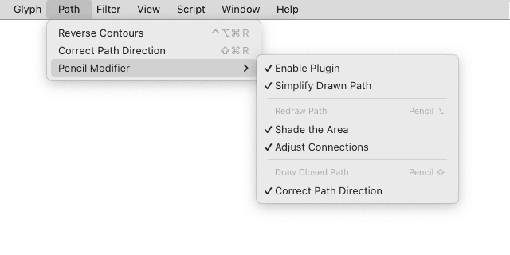
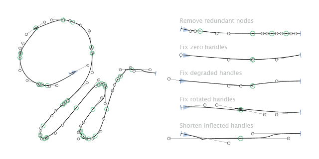

# Pencil Modifier

A plugin for the [Glyphs font editor](http://glyphsapp.com/) that enhances the Pencil tool with three features: drawing simplified paths, redrawing existing paths, and drawing closed paths.

## Features

- Simplify Path — drawing with the Pencil tool produces a clearer path by smoothing ripples, removing tight nodes, and fixing degraded or inflected handles.
- Redraw Path — hold Option `⌥` while drawing with the Pencil tool to merge drawn path with the nearest existing path, creating smooth connections where they join.
- Draw Closed Path — hold Shift `⇧` while drawing with the Pencil tool to automatically close drawn path.

## Installation

In `Menu > Window > Plugin Manager`, search Pencil Modifier, click Install, and restart Glyphs.

## Settings

The plugin settings are located in `Menu > Path > Pencil Modifier`.

## Constants

	
Simplify Path

`SMOOTH_OUT_RIPPLES_ANGLE` = `10`. Maximum angle tolerance in which almost straight sequences will be adjusted onto their average vectors. Recommended range: `0-30` degrees.

`TIGHT_NODES_THRESHOLD` = `10`. Nodes that lies closer to each other than a threshold, will be removed. Smaller value gives more accuracy, greater value gives more smoothness.

`TIGHT_NODES_TURNS_ANGLE` = `90`. Maximal angle (between three on-curve nodes) on shape turns when the node will be preserved. Smaller angle gives more smoothness (preserve more nodes), greater angle gives more accuracy. Recommended range: `60-120` degrees.

`DEGRADED_HANDLE_MIN_LENGTH` = `2`. Minimal handle length after pulling zero/turned-backward/rotated handle out from node. Minimum value should be `1`, greater value gives more smoothness.

`DEGRADED_HANDLE_ANGLE_TOLERANCE` = `30`. Maximum angle tolerance when handle and opposite handle/node are facing same or opposite direction. Normally, when handle turned backward, angle is 0, and if is opposed to opposite, angle is 180. Recommended range: `0-45` degrees.

`INFLECTION_HANDLE_MIN_LENGTH` = `1`. # Minimal handle length after fixing inflection of handles on the same segment. Double intersection = loop, single intersection = inflection, non-intersection = S-like inflection. Minimum value should be `1` to avoid handle collapsing with its node.

`INFLECTION_BUFFER` = `1`. Minimal distance from handle to intersection point after fixing inflection. If distance is 0, two handles may collapse in the intersection point.

`INFLECTION_S_MIN_ANGLE` = `135`. Minimal angle to fix S-like inflection when no handle intersects vector of its partner. 180 degree is continuous parallel handles looking into each other. 90 degree is perpendicular handles. Recommended range: `135-180` degrees.

	
Redraw Path

`CLOSEST_AREA_VIRTUAL_POINT_STEP` = `10`. Accuracy for finding closest path and its closest segments to merge. Smaller value gives better accuracy but produces more computation. Greater value will improve performance but reduce accuracy. Minimal recommended value is `5`.

`CONNECTION_ADJUST_MAX_DISTANCE` = `50`. Maximal distance between connection nodes where new path node will be adjusted. New path node moves to intermediate point.

`CONNECTION_COLLAPSE_MAX_DISTANCE` = `25`. Maximal distance when new path connection node should collapse with closest path node. Within this distance, new path node directly moves onto closest path node position.

`CONNECTION_HANDLE_MIN_LENGTH` = `20`. Minimal length of new path connection handle after adjusting it along closest path shape. Smaller value provides sharper connection, greater value provides more smoothness.

## How it works

	
Simplify Path

1. Pencil tool is active.
2. Path is drawn.
3. Smooth out ripples on almost straight sequences of segments. Nodes and handles of each sequence will be aligned with their average vector. Inner redundant nodes on sequences will be removed.
4. Remove tight nodes that lies too close to each other in the threshold range. The default threshold is `10` units and controlled by `TIGHT_NODES_THRESHOLD` constant at the beginning of the `RedrawPath.py` file. Nodes protected from removal: first and last node; smooth extreme nodes on x or y axis; nodes on sharp turns of shape.
5. Fix degraded handles (that are zero width or turned backward or rotated around its node) by pulling them out from node to inner side of segment. The goal of this step is to prevent kinks and loops around the node. If node is smooth, it tries to preserve shape direction defined by previous (outer, behind node, from adjacent segment) node/handle. Otherwise, the problematic handle will be directed halfway to its partner handle on current segment. This step runs twice — first time before removing tight nodes (to preserve the shape smoothness) and second time after it (to fix turned backward handles sometimes produced by node removal).
6. Shorten intersected handles that have a loop or inflection. If handle intersect its partner handle on the same segment, producing inflection or loop, it will be shortened to the intersection point (also with subtracting 1 unit to avoid handles collapse). Minimal handle length after shortening calculated dynamically — it is equal to 1/5 of segment length but never shorter than `INFLECTION_HANDLE_MIN_LENGTH` constant. Such a dynamic approach help to avoid kinks after shortening.
7. Shorten handles that creates S-like inflection, when they lies almost parallel and looking towards each other. Handles will be shortened to midpoint between them (also with subtracting 1 unit to avoid handles collapse), and also they both could be shifted from the edge of segment to prevent any handle appearing too short or turning backwards behind its node.

	
Redraw Path

1. Pencil tool is active.
2. Option key is held before starting to draw.
3. Shade the closest area that is near the mouse cursor position. It will be updated while you drawing.
4. Path is drawn.
5. Identify connection nodes on new (drawn) path. First node of new path is always the start connection node, and last node is the end connection node. If the new path will be reversed (to match the closest existing path winding direction), the connection nodes will be swapped respectively.
6. Find closest area on closest path and detect nodes for connection. Find two closest segments on the same existing path – one that is closer to start side of new path and another one that is closer to end side of new path. Find the closest area that includes both closest segments and shortest (by amount of nodes) side between them. If the closest path was open and its last-first nodes lies inside the closest area, then safely close the path without shifting closest area indices. This is the case when new path is intended to connect the closest path ends. Find connection nodes and connection vectors on existing path.
7. Ensure new path follow the same direction as closest path and their indices follows the same flow. Check indices order on the first two nodes of the closest area (with wraparound). If indices order is decreasing, that means that new path has different winding direction form existing path direction. If new path winding direction is different from existing path direction, then new path will be reversed, and all the references to nodes will be swapped respectively. So, after reverse, start becomes end and end becomes start.
8. Merge closest path and new path. Remove nodes inside the closest area. Fix the end connection node type on the existing path if its segment wasn't `LINE`. Insert nodes of new path. Remove new path. Re-identify new path nodes after merge.
9. Adjust new path connection nodes and handles to preserve existing path smothness. Step is optional and controlled by the `Menu > Path > Pencil Modifier > Adjust Connections` option, and is active by default. New path connection nodes are placed on existing path vectors saved before the merge. If connection nodes of new and existing paths are close, they will be merged in the same coordinate. New path connection handles (if presented) are placed on existing path vectors as well.
10. Adjust connection handles to avoid loops or inflections. Step is optional and controlled by the `Menu > Path > Pencil Modifier > Adjust Connections` option, and is active by default. If start or end connection segments are curves (usually they are), they handles will be shortened to avoid loops or inflections.

	
Draw Closed Path

1. Pencil tool is active.
2. Shift key is held before starting to draw.
3. Path is drawn.
4. Close drawn path.
5. Correct path direction. Step is optional and controlled by the `Menu > Path > Pencil Modifier > Correct Path Direction` option, and is active by default. It allows to draw a shape or counter shape without thinking what winding direction is correct.

## Standalone scripts
- [Simplify Path](PencilModifier.glyphsPlugin/Contents/Resources/SimplifyPath.py) — smoothes ripples, removes tight nodes, and fixes degraded or inflected handles. In plugin, it processes last drawn path. In standalone version, it processes the selected path or all paths on layer if nothing is selected. The script is primarily designed for rough outlines sketched with a Pencil tool or traced from a raster images.
- [Redraw Path](PencilModifier.glyphsPlugin/Contents/Resources/RedrawPath.py) — merges last added path with the nearest path into one continuous path with smooth connections. In plugin, it processes last drawn path. In standalone version, it processes the path that is last added to the layer.

## Project background

I was working on a font style that needed to be carefully aged manually, with each letter treated individually. The letters had to be redrawn in many places to create natural-looking scuffs, chips, and internal scratches. I started sketching them in Adobe Illustrator using the *Edit Selected Paths* feature. However, the redrawn outlines often came out quite noisy, with many unnecessary nodes. The paths were usually left open and sometimes had the wrong winding direction. Additionally, each letter’s outline had to be moved from Illustrator back to Glyphs, which required realignment, path closure, correction, and cleanup. And all of this had to be done for a large number of glyphs. This plugin automates all those technical steps, handling them under the hood. It has saved me weeks of time and allowed me to focus on the creative aspects instead of the technical ones. I hope it helps you too.

## Donate

This plugin is free to use. If it saves you time or makes your work easier, consider supporting my work:

[Ko-fi](https://ko-fi.com/michaelrafailyk), [PayPal](https://www.paypal.com/donate/?hosted_button_id=NF99TTG7WLHZS)